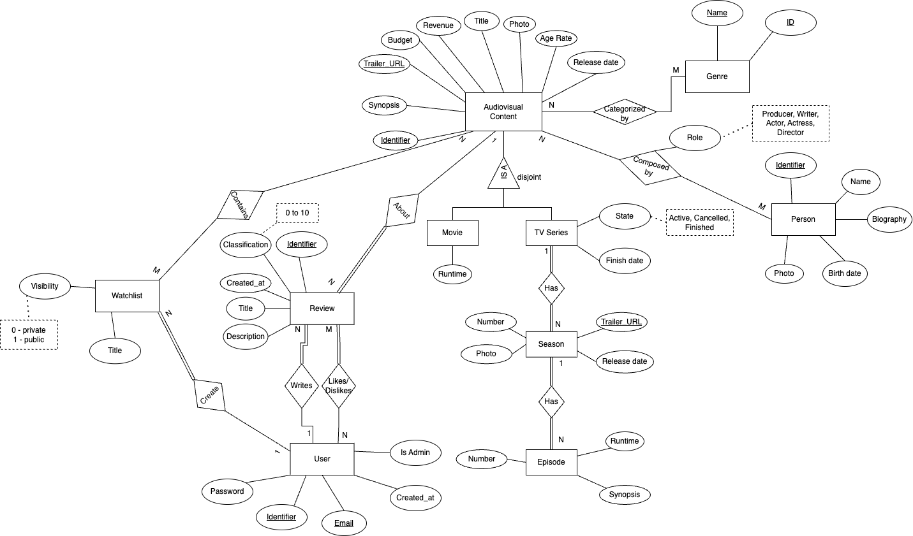
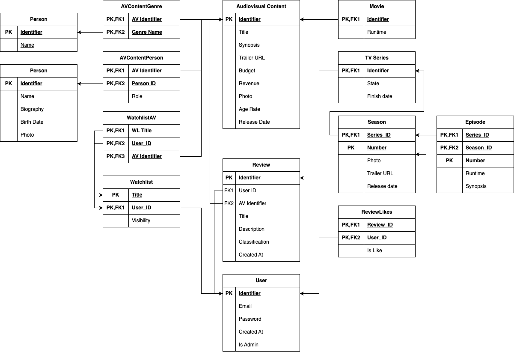
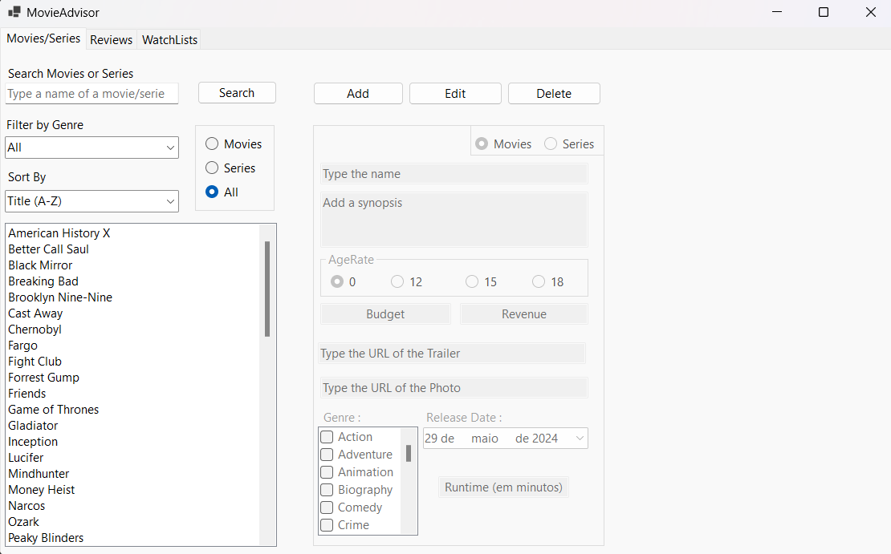
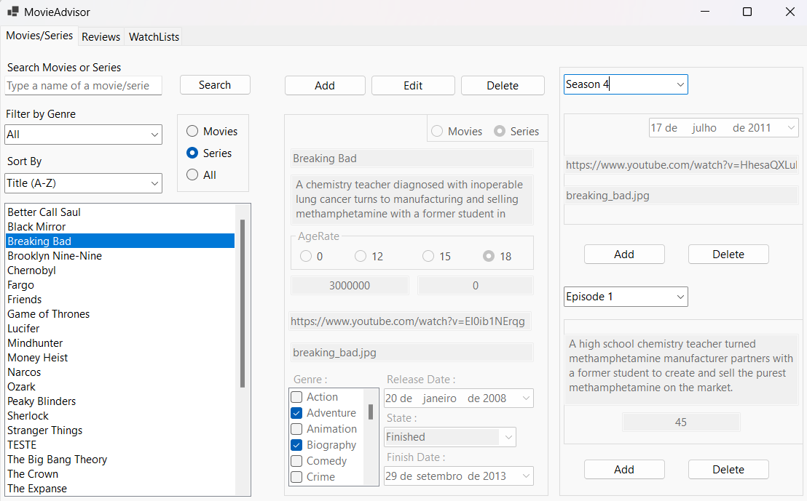
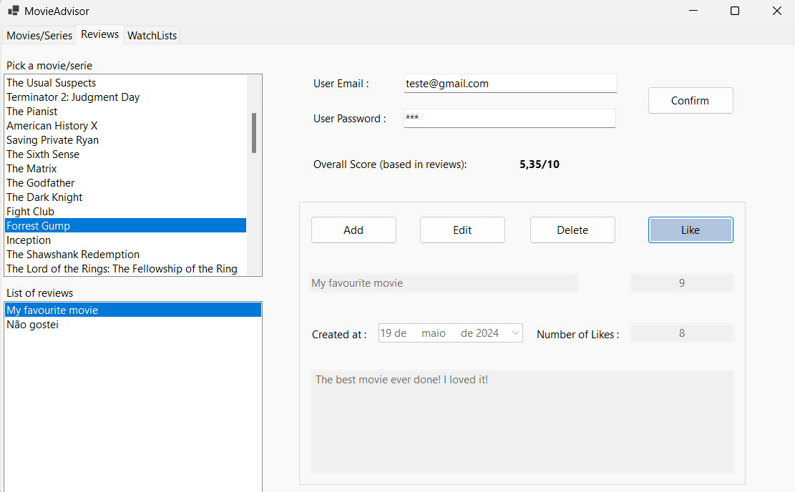
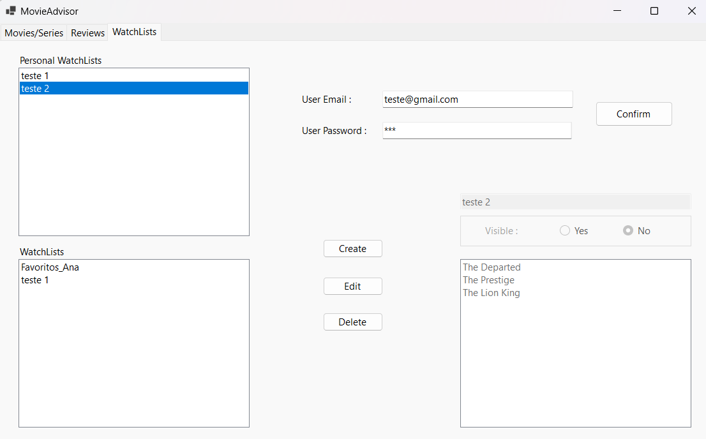

# BD: Trabalho Prático APF-T

**Grupo**: P4G1
- David Amorim, NMEC: 112610
- Francisca Silva, NMEC: 112841

## Introdução / Introduction
 
Uma base de dados para uma plataforma de reviews de filmes e séries, que permite aos utilizadores deixar uma crítica, ver críticas, adicionar conteúdos para uma lista ou procurar algo para ver, aplicando filtros com base nos géneros, entre outros. Permite também ver os detalhes de filmes/séries tais como ano de lançamento, orçamento, sinopse, descrição, etc.

## ​Análise de Requisitos / Requirements

## DER - Diagrama Entidade Relacionamento/Entity Relationship Diagram

### Versão final/Final version



### APFE 

Foi removido o atributo "popularity" do AudiovisualContent, já que este iria ser calculado a partir das reviews de utilizadores (UDF overallScoreByID).
Foi também removido o atributo birthdate do "User".
Na entidade Genre foi adicionado um atributo ID como PK.

## ER - Esquema Relacional/Relational Schema

### Versão final/Final Version



### APFE

Foi removido o atributo "popularity" do AudiovisualContent, já que este iria ser calculado a partir das reviews de utilizadores (UDF overallScoreByID).
Foi também removido o atributo birthdate do "User".
Na entidade Genre foi adicionado um atributo ID como PK.

## ​SQL DDL - Data Definition Language

[SQL DDL File](SQL/01_ddl.sql "SQLFileQuestion")

## SQL DML - Data Manipulation Language

### Formulario filmes e séries




```sql
-- Load all audiovisual contents
SELECT * FROM AudioVisualContent;
-- Load all movies (View)
SELECT * FROM AllMovies;
-- Load all series (View)
SELECT * FROM AllSeries;

-- Load genres list
SELECT * FROM Genres;

-- Load genres of an audiovisual content
SELECT ID FROM getAVContentGenres(ID);

SELECT * FROM Movie WHERE ID=@ID; -- Load the remaining movie details
SELECT * FROM TVSeries WHERE ID=@ID; -- Load the remaining serie details

-- Search bar
SELECT * FROM AudioVisualContent WHERE Title LIKE @Search; -- @Search é um parâmetro que irá ter % no final, para dar match a todos os títulos que comecem por

-- Order by title
SELECT * FROM AudioVisualContent ORDER BY Title;

-- Order by title [Z-A]
SELECT * FROM AudioVisualContent ORDER BY Title DESC;

-- Order by release date
SELECT * FROM AudioVisualContent ORDER BY ReleaseDate;

-- Order by release date (desc)
SELECT * FROM AudioVisualContent ORDER BY ReleaseDate DESC;

-- Filter movies by genre
SELECT * FROM filterMoviesByGenre(GenreId); -- UDF

-- Filter audiovisual content by genre
SELECT * FROM filterAVByGenre(GenreId); -- UDF

-- Delete audiovisualcontent
DELETE AudioVisualContent WHERE ID=@ID;

-- Delete season
DELETE Season WHERE ID=@ID AND Number=@Number;

-- Delete episode
DELETE Episode WHERE Series_ID=@ID AND Season_ID=@Number AND Number=@EpisodeNumber

-- Get all seasons of serie
SELECT * FROM getAllSeasonsOfSerie(@av_id);

-- Get all episodes of season
SELECT * FROM getAllEpisodesOfSeason(@av_id, @sNumber);

-- Exec SP to create a movie
EXEC CreateMovie Params...
-- Exec SP to update a movie
DECLARE @GenreList GenreList; INSERT INTO @GenreList VALUES (GenreID1), (GenreID2) ...;
EXEC UpdateMovie Params, @GenreList...
-- Exec SP to create serie
EXEC CreateSerie Params...
-- Exec SP to create season
EXEC CreateSeason Params...
-- Exec SP to create episode
EXEC CreateEpisode....
-- Exec SP to update serie
DECLARE @GenreList GenreList; INSERT INTO @GenreList VALUES (GenreID1), (GenreID2) ...;
EXEC UpdateSerie Params, @GenreList..
-- Exec SP to update season
EXEC UpdateSeason Params..
-- Exec SP to update episode
EXEC UpdateEpisode Params..
```

### Formulário de Reviews



```sql
-- Get all reviews of an audiovisual content
SELECT * FROM getAVContentReviews(@ID);

-- Get the overall score of the audiovisual content
SELECT dbo.overallScoreByID(@ID);

-- Get all likes of a review
SELECT * FROM ReviewLikes WHERE UserID=@utilizador AND ReviewID = @r_id;

-- Exec SP for user authentication
EXEC Authenticate Params...
-- Exec SP for create a review
EXEC CreateReview Params...
-- Exec SP for update a review
EXEC UpdateReview Params...
-- Exec SP for delete a review
EXEC DeleteReview Params...
-- Exec SP for add a like in a review
EXEC CreateReviewLike Params...
-- Exec SP for delete a like in a review
EXEC DeleteReviewLike Params...
```

### Formulário de Watchlists



```sql
-- Display all av contents for adding to watchlists
SELECT * FROM AudiovisualContent;

-- Get all watchlists of an user
SELECT * FROM getUserWatchlists(@UserID);
-- Get av contents from a watchlist
SELECT * FROM getAVFromWatchlist(@Title, @UserID);

-- Delete watchlist
DELETE WatchList WHERE Title=@Title AND UserID=@UserID;

-- Exec SP for user authentication
EXEC Authenticate Params...
-- Exec SP for watchlist creation
EXEC CreateWatchlist Params..
-- Exec SP for update a watchlist
DECLARE @AVList AVList; INSERT INTO @AVList VALUES (AVID1), (AVID2) ...;
EXEC UpdateWatchlist Params, @AVList
-- Exec SP for adding an audiovisual content to a watchlist
EXEC AddAvContentToWatchlist @WLTitle, @UserID, @AVIdentifier 
-- Exec SP for removing an audiovisual content to a watchlist
EXEC RemoveAvContentFromWatchlist @WLTitle, @UserID, @AVIdentifier 
```

## Normalização/Normalization

Durante o processo de criação da nossa base de dados, procurámos eliminar redundâncias e inconsistências, tendo o cuidado de ao longo deste processo rever todas as entidades e relações estabelecidas entre elas.
Inicialmente, verificámos que a nossa base de dados se encontrava na 1FN, uma vez que os atributos são atómicos e não são suportadas relações dentro de relações.
Por exemplo, em vez de um AudiovisualContent ter um atributo multivalor géneros, decompusemos a relação em duas na 1FN, criando assim uma tabela para os géneros e uma que interligasse os géneros ao AudiovisualContent.
Posteriormente, verificámos que a nossa base de dados se encontrava na 2FN, pois não encontrámos qualquer dependência parcial, ou seja, todas as relações têm dependências totais.
Por fim, verificámos que a nossa base de dados se encontra na 3FN, uma vez que não existem dependências transitivas.

## Índices/Indexes

Foi criado um índice para o título de AudiovisualContent, de modo a otimizar a query de procura por nome de filmes/séries.
Foi criado um índice para a release date de AudiovisualContent, para otimizar a query de ordenação por data de lançamento do conteúdo.
Foi criado um índice para o nome de Person, para otimizar a query de procura por nome de Pessoas.
Foi criado um índice para o Email de User, para otimizar a procura de users por email, nomeadamente no stored procedure de autenticação.

```sql
-- Search content by title
CREATE NONCLUSTERED INDEX IX_AVTitle ON AudioVisualContent(Title)
-- Order by release date
CREATE NONCLUSTERED INDEX IX_ReleaseDate ON AudioVisualContent(ReleaseDate)
-- Search by person name
CREATE NONCLUSTERED INDEX IX_PersonName ON Person(Name);
-- Authentication, search by email
CREATE NONCLUSTERED INDEX IX_UserEmail ON "User"(Email);
```

## SQL Programming: Stored Procedures, Triggers, UDF

[SQL SPs and Functions File](SQL/02_sp_functions.sql "SQLFileQuestion")

[SQL Triggers File](SQL/03_triggers.sql "SQLFileQuestion")

## Outras notas/Other notes

### Dados iniciais da dabase de dados/Database init data

[Inserts File](SQL/04_db_init.sql "SQLFileQuestion")


### Types

Criámos dois types auxiliares, que são usados como argumentos nos stored procedures de UpdateGenres e UpdateWatchlists

```sql
-- Type for adding multiple genres on movie / serie creation
CREATE TYPE GenreList AS TABLE (ID INT);
-- Type for updating audiovisualcontent of watchlists
CREATE TYPE AVList AS TABLE (ID INT);
```

### Teste de índices


De modo a testarmos na prática o funcionamento dos índices criados, fizemos um script de testes, onde inserimos múltiplas linhas nas tabelas de AudiovisualContent e User.
Comparámos o tempo das queries de leitura de dados e aferimos que sem índices o tempo aumentava linearmente, com os índices o tempo era praticamente constante.
Resultados da experiência:

#### AudioVisualContent(Title) NONCLUSTERED INDEX

| Records | Without index (ms) | With index (ms) |
| ------- | ------------------ | --------------- |
|     60  |                  3 |               3 |
| 100000  |                 13 |               0 |
| 200000  |                 20 |               3 |
| 300000  |                 33 |               7 |
| 400000  |                 40 |               3 |
| 500000  |                 53 |               3 |
| 600000  |                 67 |               7 |
| 700000  |                 76 |               4 |
| 800000  |                107 |               4 |

#### User SP Authenticate User(Email) NONCLUSTERED INDEX

| Records | Without index (ms) | With index (ms) |
| ------- | ------------------ | --------------- |
|     24  |                 10 |               7 |
| 100000  |                 87 |               6 |
| 200000  |                 87 |               7 |
| 300000  |                100 |               7 |
| 400000  |                184 |               7 |
| 500000  |                107 |               7 |
| 600000  |                134 |               4 |
| 700000  |                107 |               6 |
| 800000  |                114 |               3 |

### Segurança

Tomámos algumas medidas para tornar o acesso à nossa base de dados mais seguro, nomeadamente, usando Stored Procedures e UDFs (uma camada de abstração, em vez de a aplicação ter acesso direto ao modelo de dados) sempre que possível, e queries parametrizadas, de modo a previnir possíveis ataques de SQL Injection.
Como a nossa base de dados contém passwords de utilizadores, não as guardamos em plain text, mas sim hashed, usando SHA512 (realizado no SP Authenticate)
